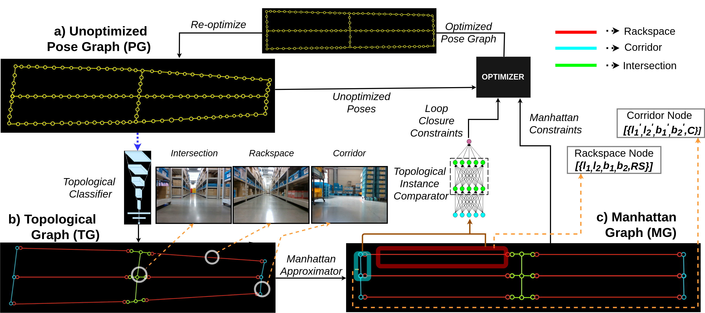
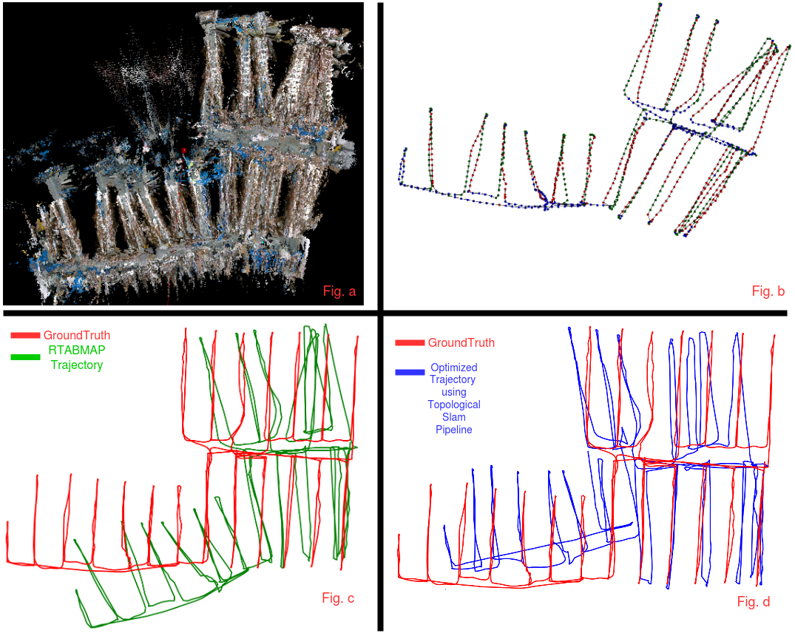
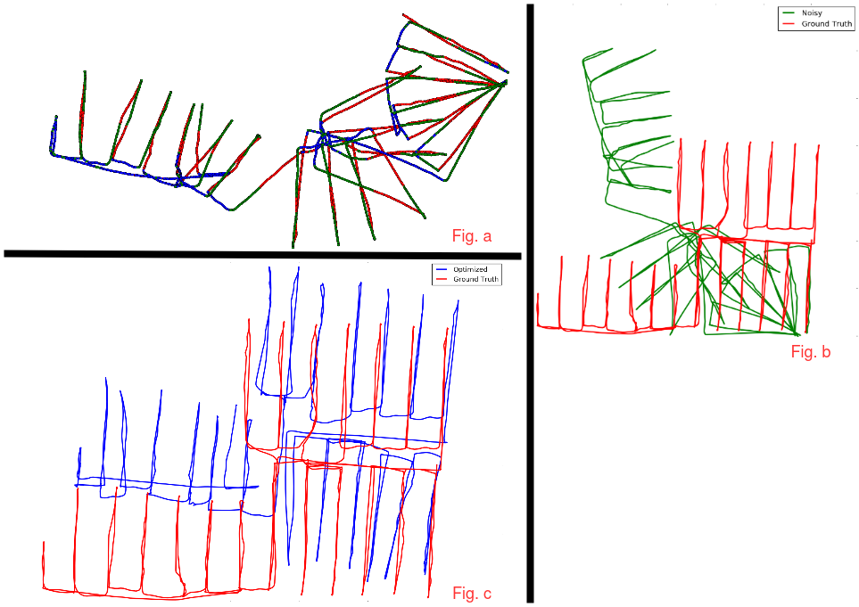

# Code release for the ICRA 2020 paper "Topological Mapping for Manhattan-like Repetitive Environments"

Sai Shubodh Puligilla\*, Satyajit Tourani\*, Tushar Vaidya\*, Udit Singh Parihar\*, Ravi Kiran Sarvadevabhatla and K. Madhava Krishna

> Links to [**Paper**](https://arxiv.org/abs/2002.06575) and [**Video**](https://www.youtube.com/watch?v=swYcwrjprh0)

[In Progress - Code Demos will be added by first week of March]

# Introduction

We showcase a topological mapping framework for a challenging indoor warehouse setting. At the most abstract level, the warehouse is represented as a Topological Graph where the nodes of the graph represent a particular warehouse topological construct (e.g. rackspace, corridor) and the edges denote the existence of a path between two neighbouring nodes or topologies. At the intermediate level, the map is represented as a Manhattan Graph where the nodes and edges are characterized by Manhattan properties and as a Pose Graph at the lower-most level of detail. The topological constructs are learned via a Deep Convolutional Network while the relational properties between topological instances are learnt via a Siamese-style Neural Network. In the paper, we show that maintaining abstractions such as Topological Graph and Manhattan Graph help in recovering an accurate Pose Graph starting from a highly erroneous and unoptimized Pose Graph. We show how this is achieved by embedding topological and Manhattan relations as well as Manhattan Graph aided loop closure relations as constraints in the backend Pose Graph optimization framework. The recovery of near ground-truth Pose Graph on real-world indoor warehouse scenes vindicate the efficacy of the proposed framework.

<p align="center">
    
</p>


# Code

Our pipeline consists of 3 parts - each sub-folder in this repo containts code for each:
1. Topological categorization using a convolutional neural network classifier -> Topological Classifier
2. Predicting loop closure constraints using Multi-Layer Perceptron -> Instance Comparator
3. Graph construction and pose graph optimization using obtained Manhattan and Loop Closure Constraints -> Pose Graph Optimizer

How to use each is explained in corresponding sub-folder.


# Citation:
 
If you find our work useful in your research, please consider citing:
```

```

# Qualitative Results:    

1. RTABMAP SLAM
<p align="center">
    
</p>


Fig. a shows registered map generated by RTABMAP Slam. Fig. b shows RTABMAP trajectory with topological labels. Fig. c compares the RTABMAP trajectory with groundtruth trajectory. Fig. d compares trajectory generated using our topological SLAM pipeline with groundtruth.


2. RTABMAP as Visual Odometry pipeline
<p align="center">
    
</p>


Fig. a shows trajectory obtained using RTABMAP with loop closure turn off. Wheel odometry is used as odometry source. Fig. b compares RTABMAP trajectory with groundtruth. Fig. c compares trajectory obtained using Topological Slam pipeline with groundtruth.
